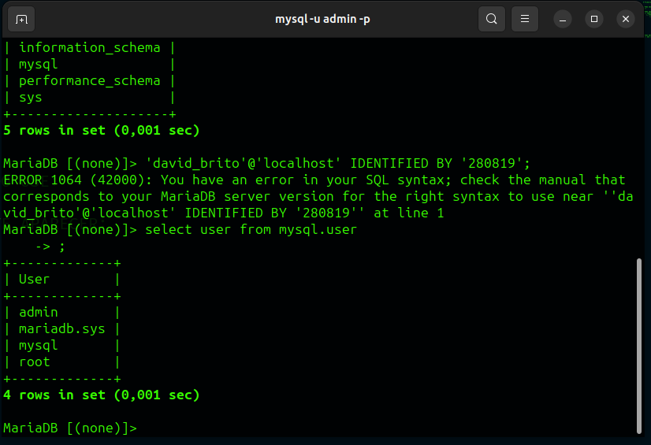
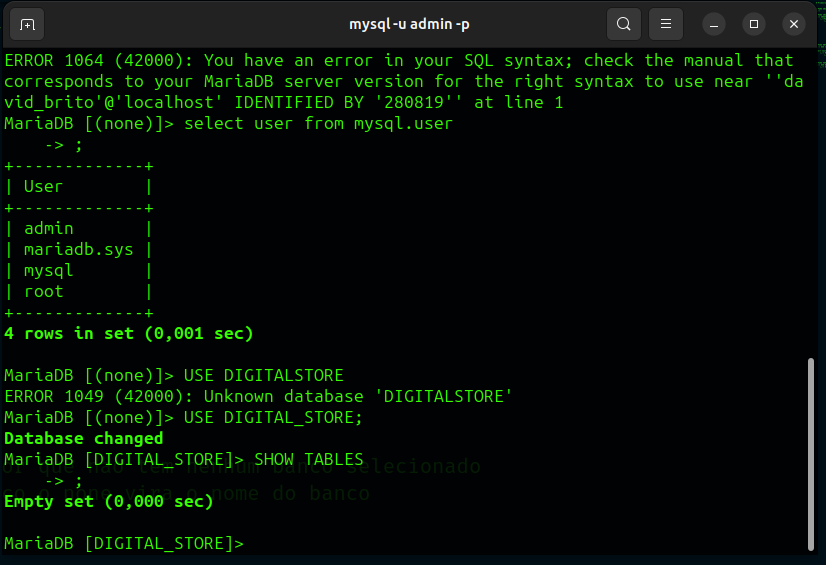

# Primeiros Passos com o **MariaDB**

<!-- # 1 SEMPRE UTILIZAR PONTO E VIRGULA NO FINAL DAS EXPRESSÕES -->

# INSTALAÇÃO DO MARIADB (MYSQL) (LINUX DEBIAN);

**Passo A passo Terminal**

## |\_-> sudo apt install mariadb-server -y

**DEPOIS PRECISAMOS LOGAR NO MYSQL**

## |\_-> sudo mysql -u root -p

## CASO ENTRE DIRETO SEM PEDIR SENHA NO ROOT VOCÊ PRECISA DEFINIR UMA NOVA SENHA PARA O ROOT (SENHA MUITO SEGURA PARA EVITAR INVASÕES AO SEU BANCO DE DADOS COM OS PODERES DO ROOT)

## |\_-> use mysql

## |\_-> UPDATE USER SET PLUGIN='' WHERE USER='root';

## |\_-> FLUSH PRIVILEGES;

## |\_-> (QUIT) PARA SAIR;

# - - - - - - - - - - - - - - - - - - - - - - - - - - - - #\*\*

# CASO TENHA ACABADO DE INSTALAR PELA PRIMEIRA VEZ: USE ESSE PASSO A PASSO;

## |\_-> SUDO mysql secure_installation

### APOS O COMANDO DE CIMA O TERMINAL VAI LHE FAZER ALGUMAS PERGUNTAS SO RESPONDER;

# - - - - - - - - - - - - - - - - - - - - - - - - - - - -

# PARA CRIAR UM USUARIO:

|\_-> CREATE USER IF NOT EXISTS '<user>'@'localhost' IDENTIFIED BY '<SUA SENHA DE NOVO USUARIO>'

# PARA FORNECER AS PERMIÇÕES DO USUARIO CRIADO USE:

|\_-> GRANT ALL PRIVILEGES ON <nome do banco.\*> TO <USER>@localhost;

## |\_-> OU PARA DEFINIR PERMISSAO A TODOS OS BANCOS DE DADOS USE:

 |\_-> GRANT ALL PRIVILEGES ON _._ TO '<USER>'@'localhost' IDENTIFIED BY 'SENHA DO USER' WITH GRANT OPTION;

|\_-> FLUSH PRIVILEGES; (ATUALIZAR AS PERMISSOES);

### PARA ACESSAR USANDO O NOVO USUARIO CRIADO USE:

#### |\_-> mysql -u <user> -p;

#### |\_-> FORNECER A SENHA DEFINIDA DO REFERIDO USUARIO:

# PARA LISTAR OS BANCOS DE DADOS ESTANDO NA RAIZ DO DB USE:

## |\_-> SHOW DATABASES;

# PARA CRIAR UM BANCO DE DADOS:

## |\_-> **CREATE DATABASE <NOME DO BANCO>**

    |_->PARA TER CERTEZA QUE O BANCO FOI CRIADO USE:
        |_-> SHOW DATABASE;
            |_-> UMA TELA IGUAL A DE BAIXO DEVE APARECER:
                    +--------------------+
                    | Database           |
                    +--------------------+
                    | <NOME DO BANCO>    |
                    | <NOME DO BANCO>    |
                    | <NOME DO BANCO>    |
                    | <NOME DO BANCO>    |
                    | <NOME DO BANCO>    |
                    +--------------------+

# PARA ENTRAR EM UM BANCO DE DADOS USE:

## |\_-> **USE <NOME-DO-BANCO>**

; |_-> NOTE QUE NO FINAL DA LINHA TEM: |_-> MariaDB
[(none)]> O (none) -> é por que nao tem nenhum banco selecionado |\_-> Quando
Selecionamos algum banco o none vira o nome do banco

# PARA VER AS TABELAS DENTRO DE UM BANCO DE DADOS:

## |\_-> USE O SEGUINTE COMANDO:

|_-> **SHOW TABLES** |_-> UMA TELA IGUAL A ESSA DEVERÁ APARECER:
; |\_-> SE VOCÊ TIVER CRIADO O BANCO AGORA O NOME EMPTY
DEVERA APARECER ASSIM: Empty set (0,000 sec) - - - > INDICANDO QUE O BANCO NÃO
POSSUI NENHUMA TABELA CRIADA

#PARA CRIAR TABELAS NO SEU BANCO DE DADOS USE:

## |\_-> **CREATE TABLE IF NOT EXISTIS <NOME-DA-TABELA>** - - -> **(IF NOT EXISTIS)** SIGNIFICA QUE SE NÃO EXISTIR ELE CRIE UMA TABELA COM O NOME INDICADO

## |\_-> **CREATE TABLE IF NOT EXISTIS <NOME-DA-TABELA>(
    id (TIPO DE DADO) NOT NULL AUTO_INCREMENT,
    campo2 DATE,
    qualquer VARCHAR(10) NOT NULL,
    CONSTRAINT id_pk PRIMARY KEY (id)
    DEFINIÇÃO DA CHAVE PRIMARIA
    CONTRAINT SIGNIFICA AS RESTRIÇÕES DE INTEGRIDADE DO BANCO DE DADOS;

);

## PARA VISUALIZAR OS CAMPOS CRIADOS DENTRO DA TABELA USE:
## |_-> SHOW COLUMNS FROM <table_name>

### PARA EXCLUIR ALGUMA TABELA USE:

#### |\_-> DROP TABLE <nome-da-tabela>;

